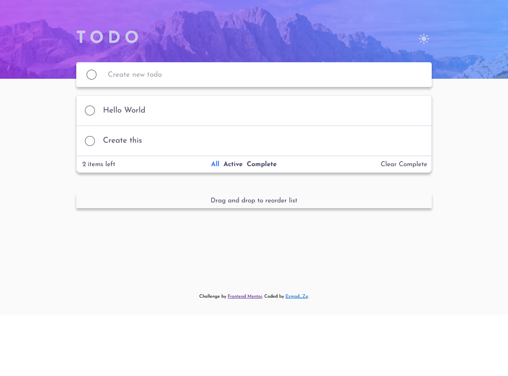
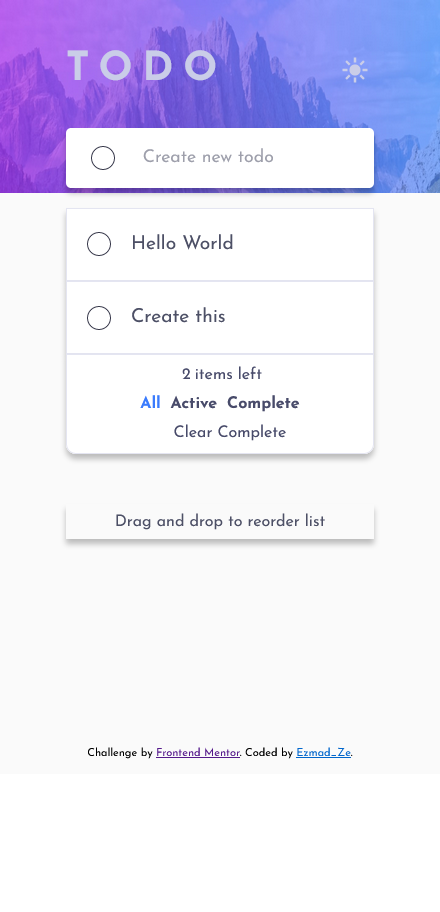

# Frontend Mentor - Todo app solution

This is a solution to the [Todo app challenge on Frontend Mentor](https://www.frontendmentor.io/challenges/todo-app-Su1_KokOW). Frontend Mentor challenges help you improve your coding skills by building realistic projects. 

## Table of contents

- [Overview](#overview)
  - [The challenge](#the-challenge)
  - [Screenshot](#screenshot)
  - [Links](#links)
- [My process](#my-process)
  - [Built with](#built-with)
  - [What I learned](#what-i-learned)
  - [Useful resources](#useful-resources)
- [Author](#author)

## Overview

### The challenge

Users should be able to:

- View the optimal layout for the app depending on their device's screen size
- See hover states for all interactive elements on the page
- Add new todos to the list
- Mark todos as complete
- Delete todos from the list
- Filter by all/active/complete todos
- Clear all completed todos
- Toggle light and dark mode
- **Bonus**: Drag and drop to reorder items on the list

### Screenshot

### Links

- Solution URL: 
- Live Site URL: 

## My process

### Built with

- Semantic HTML5 markup
- CSS custom properties
- Flexbox
- CSS Grid
- [React](https://reactjs.org/) - JS library

### What I learned

I learned how to work with React JS and how to implement Draggable components.

### Useful resources

- [Save State to LocalStorage & Persist on Refresh with React.js by Colby Fayock](https://www.youtube.com/watch?v=rWfhwW9forg ) - This helped me to work with Local Storage. 
- [How to Add Drag and Drop in React with React Beautiful DnD Colby  Fayock](https://www.youtube.com/watch?v=aYZRRyukuIw) - This is an amazing video which helped me finally understand drag and drop components. 

## Author

- Frontend Mentor - [@Ezmad-Ze](https://www.frontendmentor.io/profile/Ezmad-Ze)

